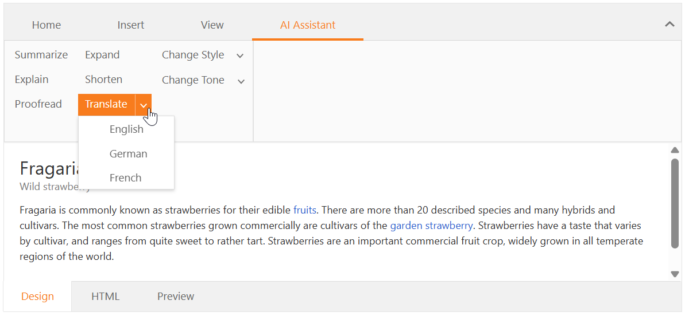
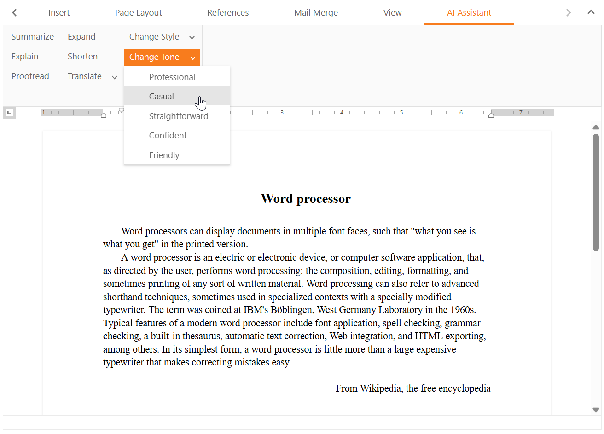

<!-- default badges list -->
[](https://supportcenter.devexpress.com/ticket/details/T1311841)
[](https://docs.devexpress.com/GeneralInformation/403183)
[](#does-this-example-address-your-development-requirementsobjectives)
<!-- default badges end -->
# ASP.NET Web Forms HTML Editor and Rich Text Editor - Integrate AI-powered Extensions

This example integrates AI-powered extensions into both the ASP.NET Web Forms HTML Editor and Rich Text Editor. These extensions supply AI functions designed to process text/HTML content.

## Implementation Details

This example adds a custom **AI Assistant** ribbon tab to both Rich Text Editor ([ASPxRichEdit](https://docs.devexpress.com/AspNet/DevExpress.Web.ASPxRichEdit.ASPxRichEdit)) and HTML Editor ([ASPxHtmlEditor](https://docs.devexpress.com/AspNet/DevExpress.Web.ASPxHtmlEditor.ASPxHtmlEditor)) and populates this tab with the following AI-powered commands:

* **Change Style** rewrites text using the specified style.
* **Change Tone** rewrites text using the specified tone.
* **Expand** expands text.
* **Explain** explains text.
* **Proofread** proofreads text.
* **Shorten** shortens text.
* **Summarize** summarizes text.
* **Translate** translates text into the specified language.

For a full list of DevExpress AI-powered extensions and corresponding registration methods, refer to the following help topic: [AI-powered Extensions](https://docs.devexpress.com/CoreLibraries/405204/ai-powered-extensions#ai-powered-extensions).

### Register AI Services

> **Note**: 
> DevExpress AI-powered extensions follow the "bring your own key" principle. DevExpress does not offer a REST API and does not ship any built-in LLMs/SLMs. You need an active Azure/Open AI subscription to obtain the REST API endpoint, key, and model deployment name. These variables must be specified at application startup to register AI clients and enable DevExpress AI-powered Extensions in your application.

To register AI Services and activate AI-powered extensions, configure your application as follows:

* Add the following code to the [Global.asax.cs](./CS/WebFormsAIIntegration/Global.asax.cs) file:

    ```cs
    void Application_Start(object sender, EventArgs e) {
        string azureOpenAIEndpoint = Environment.GetEnvironmentVariable("AZURE_OPENAI_ENDPOINT");
        string azureOpenAIKey = Environment.GetEnvironmentVariable("AZURE_OPENAI_API_KEY");
        var defaultAIContainer = new AIExtensionsContainerDefault();
        var azureOpenAIClient = new AzureOpenAIClient(
            new Uri(azureOpenAIEndpoint),
            new ApiKeyCredential(azureOpenAIKey));

        var chatClient = azureOpenAIClient.GetChatClient("gpt-4o-mini").AsIChatClient();
        defaultAIContainer.RegisterChatClient(chatClient);
        Application["AIService"] = defaultAIContainer;
    }
    ```

* Add the [AIHelper.cs](./CS/WebFormsAIIntegration/Models/AIHelper.cs) service to your application (copy corresponding files from the [Models](./CS/WebFormsAIIntegration/Models/) folder).

> **Note**:
> We use the following versions of the `Microsoft.Extensions.AI.*` libraries in our `v25.2.3+` source code:
>
> * `Microsoft.Extensions.AI` | **9.7.1**
> * `Microsoft.Extensions.AI.OpenAI` | **9.7.1-preview.1.25365.4**
>
> Refer to the following announcement for additional information: [DevExpress.AIIntegration moves to a stable version](https://supportcenter.devexpress.com/ticket/details/t1292705/devexpress-aiintegration-references-stable-versions-of-microsoft-ai-packages).

### Add AI-powered Commands to the DevExpress ASP.NET Web Forms HTML Editor

Replicate the following steps to add AI-powered commands to the HTML Editor:

1. Create a new **AI Assistant** ribbon tab and populate it with AI-powered commands ([HtmlEditor.aspx.cs](./CS/WebFormsAIIntegration/HtmlEditor.aspx.cs)). Use the [ASPxHtmlEditor.RibbonTabs](https://docs.devexpress.com/AspNet/DevExpress.Web.ASPxHtmlEditor.ASPxHtmlEditor.RibbonTabs) property to add the tab to the ribbon tab collection.

2. Add a [ASPxCallback](https://docs.devexpress.com/AspNet/DevExpress.Web.ASPxCallback) component to page markup.

3. Handle the [ASPxHtmlEditor.CustomCommand](https://docs.devexpress.com/AspNet/js-ASPxClientHtmlEditor.CustomCommand) event to respond to AI-powered command clicks ([HtmlEditor.aspx](./CS/WebFormsAIIntegration/HtmlEditor.aspx)). In the handler, obtain the command text and pass it to the [ASPxClientCallback.PerformCallback](https://docs.devexpress.com/AspNet/js-ASPxClientCallback.PerformCallback(parameter)) method as a parameter.

    ```cs
    function OnCustomCommand(s, e) {
        if (e.commandName.startsWith('AI')) {
            const command = e.commandName.split(':')[1];
            const selectedText = s.GetSelection().GetText();
            if (selectedText !== '') {
                htmlEditor.ShowLoadingPanel();
                pendingCommand = command.split("-")[0];
                callback.PerformCallback(JSON.stringify({ Command: command, Text: selectedText }));
            }
            else {
                alert('Please select some text');
            }
        }
    }
    ```

4. Handle the [ASPxCallback.Callback](https://docs.devexpress.com/AspNet/DevExpress.Web.ASPxCallback.Callback) event to pass the command text to the [AIHelper](./CS/WebFormsAIIntegration/Models/AIHelper.cs) service and call the corresponding AI-powered method. To access modified data on the client, save the AI service response to [ASPxCallBack.JSProperties](https://docs.devexpress.com/AspNet/DevExpress.Web.ASPxCallback.JSProperties).

    ```cs
    protected async void ASPxCallback1_Callback(object source, CallbackEventArgs e) {
        ASPxCallback callback = (ASPxCallback)source;
        var aiRequestData = JsonSerializer.Deserialize<AIHelper.AIRequestData>(e.Parameter);
        var aiResponse = await AIHelper.GetResponseAsync(aiRequestData);

        callback.JSProperties["cpText"] = aiResponse;
    }
    ```

5. Handle the [ASPxCallback.CallbackComplete](https://docs.devexpress.com/AspNet/js-ASPxClientCallback.CallbackComplete) event to display modified text as needs dictate. This example invokes a [popup window](./CS/WebFormsAIIntegration/HtmlEditor.aspx#L58-L72) and allows a user to apply changes or copy modified text to the clipboard.

    ```js
    function OnCallbackComplete(s, e) {
        htmlEditor.HideLoadingPanel();
        popup.SetHeaderText(pendingCommand);
        aiTextMemo.SetText(s.cpText);
        popup.Show();
        pendingCommand = "";
    }

    function OnCopyClick(s, e) {
        if (navigator.clipboard.writeText) {
            navigator.clipboard.writeText(aiTextMemo.GetText());
        }
        popup.Hide();
    }

    function OnReplaceClick(s, e) {
        htmlEditor.GetSelection().SetHtml(aiTextMemo.GetText(), true);
        popup.Hide();
    }
    ```



### Add AI-powered Commands to the DevExpress ASP.NET Web Forms Rich Text Editor

Replicate the following steps to add AI-powered commands to the Rich Text Editor:

1. Create a new **AI Assistant** ribbon tab and populate it with AI-powered commands ([RichEdit.aspx.cs](./CS/WebFormsAIIntegration/RichEdit.aspx.cs)). Use the [ASPxRichEdit.RibbonTabs](https://docs.devexpress.com/AspNet/DevExpress.Web.ASPxRichEdit.ASPxRichEdit.RibbonTabs) property to add the tab to the ribbon tab collection.

2. Add a [ASPxCallback](https://docs.devexpress.com/AspNet/DevExpress.Web.ASPxCallback) component to page markup.

3. Handle the [ASPxRichEdit.CustomCommandExecuted](https://docs.devexpress.com/AspNet/js-ASPxClientRichEdit.CustomCommandExecuted) event to respond to AI-powered command clicks ([RichEdit.aspx](./CS/WebFormsAIIntegration/RichEdit.aspx)). In the handler, obtain the command text and pass it to the [ASPxClientCallback.PerformCallback](https://docs.devexpress.com/AspNet/js-ASPxClientCallback.PerformCallback(parameter)) method as a parameter.

    ```cs
    function OnCustomCommandExecuted(s, e) {
        if (e.commandName.startsWith('AI')) {
            const command = e.commandName.split(':')[1];
            if (s.selection.intervals.length > 0) {
                const selectedInterval = s.selection.intervals[0];
                if (selectedInterval.length > 0) {
                    const selectedText = s.document.activeSubDocument.getTextByInterval(selectedInterval);
                    richEdit.loadingPanel.show();
                    pendingCommand = command.split("-")[0];
                    callback.PerformCallback(JSON.stringify({ Command: command, Text: selectedText }));
                } else {
                    alert('Please select some text');
                }
            }
        }
    }
    ```

4. Handle the [ASPxCallback.Callback](https://docs.devexpress.com/AspNet/DevExpress.Web.ASPxCallback.Callback) event to pass the command text to the [AIHelper](./CS/WebFormsAIIntegration/Models/AIHelper.cs) service and call the corresponding AI-powered method. To access modified data on the client, save the AI service response to [ASPxCallBack.JSProperties](https://docs.devexpress.com/AspNet/DevExpress.Web.ASPxCallback.JSProperties).

    ```cs
    protected async void ASPxCallback1_Callback(object source, CallbackEventArgs e) {
        ASPxCallback callback = (ASPxCallback)source;
        var aiRequestData = JsonSerializer.Deserialize<AIHelper.AIRequestData>(e.Parameter);
        var aiResponse = await AIHelper.GetResponseAsync(aiRequestData);

        callback.JSProperties["cpText"] = aiResponse;
    }
    ```

5. Handle the [ASPxCallback.CallbackComplete](https://docs.devexpress.com/AspNet/js-ASPxClientCallback.CallbackComplete) event to display modified text as needs dictate. This example invokes a [popup window](./CS/WebFormsAIIntegration/RichEdit.aspx#L62-L76) and allows a user to apply changes or copy modified text to the clipboard.

    ```js
    function OnCallbackComplete(s, e) {
        richEdit.loadingPanel.hide();
        popup.SetHeaderText(pendingCommand);
        aiTextMemo.SetText(s.cpText);
        popup.Show();
        pendingCommand = "";
    }

    function OnCopyClick(s, e) {
        if (navigator.clipboard.writeText) {
            navigator.clipboard.writeText(aiTextMemo.GetText());
        }
        popup.Hide();
    }

    function OnReplaceClick(s, e) {
        richEdit.commands.beginUpdate();
        richEdit.commands.delete.execute();
        richEdit.commands.insertText.execute(aiTextMemo.GetText());
        richEdit.commands.endUpdate();
        popup.Hide();
    }
    ```



## Files to Review

- [HtmlEditor.aspx](./CS/WebFormsAIIntegration/HtmlEditor.aspx) / [HtmlEditor.aspx.cs](./CS/WebFormsAIIntegration/HtmlEditor.aspx.cs)
- [RichEdit.aspx](./CS/WebFormsAIIntegration/RichEdit.aspx) / [RichEdit.aspx.cs](./CS/WebFormsAIIntegration/RichEdit.aspx.cs)
- [AIHelper.cs](./CS/WebFormsAIIntegration/Models/AIHelper.cs)
- [Global.asax.cs](./CS/WebFormsAIIntegration/Global.asax.cs)

## Documentation

- [AI Integration](https://docs.devexpress.com/CoreLibraries/405204/ai-powered-extensions)
- [ASP.NET Web Forms HTML Editor](https://docs.devexpress.com/AspNet/4024/components/html-editor)
- [ASP.NET Web Forms Rich Text Editor](https://docs.devexpress.com/AspNet/17721/components/rich-text-editor)

## More Examples

- [Integrate DevExpress AI-powered Text Extensions into Console, WinForms, and WPF Apps](https://github.com/DevExpress-Examples/winforms-wpf-ai-text-extension)
- [Blazor Rich Text Editor and HTML Editor - Integrate AI-powered extensions](https://github.com/DevExpress-Examples/blazor-ai-integration-to-text-editors)

<!-- feedback -->
## Does this example address your development requirements/objectives?

[](https://www.devexpress.com/support/examples/survey.xml?utm_source=github&utm_campaign=draft-how-to-integrate-AI-in-ASPxRichEdit-and-ASPxHtmlEditor&~~~was_helpful=yes) [](https://www.devexpress.com/support/examples/survey.xml?utm_source=github&utm_campaign=draft-how-to-integrate-AI-in-ASPxRichEdit-and-ASPxHtmlEditor&~~~was_helpful=no)

(you will be redirected to DevExpress.com to submit your response)
<!-- feedback end -->
